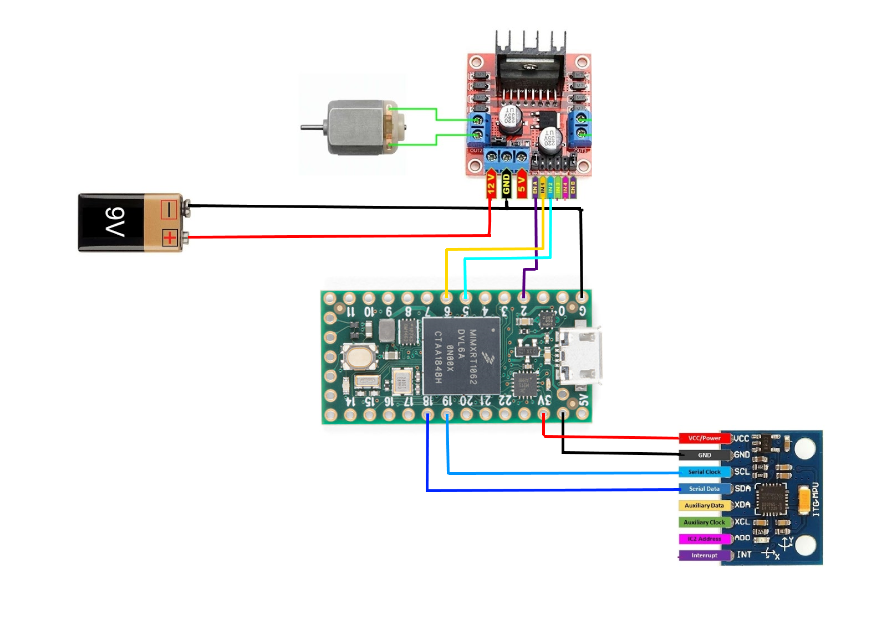

# Embedded AI workshop @ Sfhmmy 22
## Prerequisites
1. Install [Arduino IDE](https://www.arduino.cc/en/software)
2. Install [add-on for Teensy development](https://www.pjrc.com/teensy/td_download.html)
3. Install the [MPU6050 IMU library](https://www.arduino.cc/reference/en/libraries/adafruit-mpu6050/)
4. Install the [Arduino Tensorflow Lite library](https://www.arduino.cc/reference/en/libraries/arduino_tensorflowlite/)

## Connections
Pins in the same row have to be shorted.

|   Teensy 4.0   | L298N Motor Driver | MPU6050 IMU (Accel + Gyro) |   DC Motor   |      Battery    |
| :------------: | :----------------: | :------------------------: | :----------: | :-------------: |
|   G (Ground)   |         GND        |            GND             |              | Black cable (-) |
|       3.3      |                    |            VCC             |              |                 |
|        2       |         ENA        |                            |              |                 |
|        5       |         IN2        |                            |              |                 |
|        6       |         IN1        |                            |              |                 |
|    18 (SDA0)   |                    |            SDA             |              |                 |
|    19 (SCL0)   |                    |            SCL             |              |                 |
|                |      12V (VCC)     |                            |              | Red cable (+)   |
|                |         OUT1       |                            |  Red cable   |                 |
|                |         OUT2       |                            |  Black cable |                 |

Teensy 4.0 has to be also connected to a computer via a micro USB cable.

## Google Colab Notebook
https://colab.research.google.com/drive/1sfRkRf1Mil6hrIxcMpIgG6F1O9PGYyWY?usp=sharing
